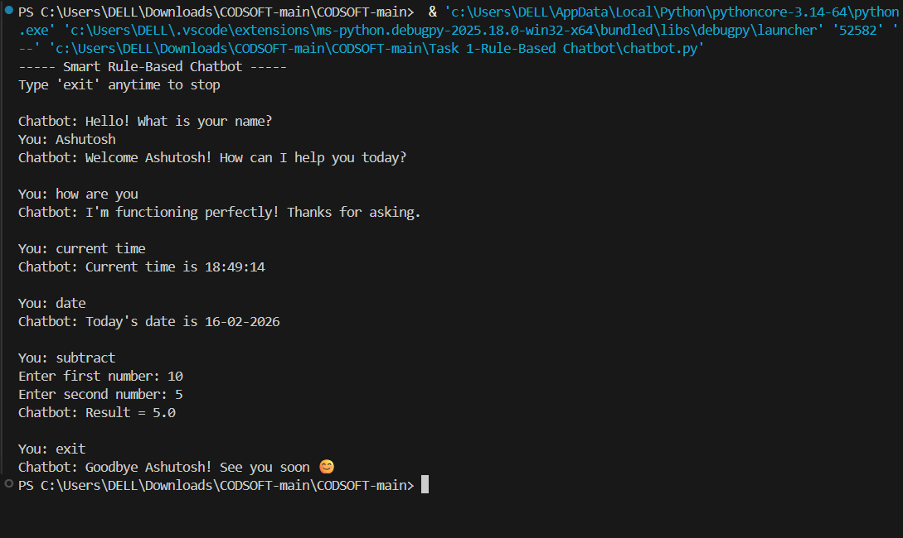

# 🤖 Rule-Based Chatbot (Python)

This project was completed as part of my **Artificial Intelligence Internship** at **CodSoft**.  
The chatbot is designed using **rule-based logic**, where responses are generated based on predefined rules and keyword matching.

---
## 🖼️ Image Preview

### Sample Input Image

### Generated Caption Output

## 📌 Project Description
A **Rule-Based Chatbot** is a simple conversational system that responds to user input using conditional statements instead of learning algorithms.

This chatbot handles basic conversations such as greetings, help requests, and simple questions.

---

## 🧠 Key Concepts Used
- Artificial Intelligence fundamentals
- Rule-based systems
- Pattern matching
- Conditional statements
- String processing

---

## ✨ Features
- Responds to greetings (hi, hello, hey)
- Answers basic questions like:
  - How are you?
  - What is your name?
- Help command to display chatbot capabilities
- Exit command (`bye`)
- Case-insensitive input handling

---

## 🛠️ Technologies Used
- Python 3
- Rule-based Artificial Intelligence
- No external libraries required

---

## ▶️ How It Works
1. User enters a message  
2. Chatbot matches input with predefined rules  
3. Corresponding response is generated  
4. Conversation continues until user exits  

---

## 🎯 Learning Outcomes
- Understanding rule-based AI systems
- Implementing chatbot logic in Python
- Improving string handling skills
- Building interactive console applications

---

## 📄 Conclusion
This project provided practical experience in developing a **rule-based chatbot**, strengthening my foundation in **Artificial Intelligence concepts using Python**.

---

## 📜 License

This project is created for educational and internship purposes.
