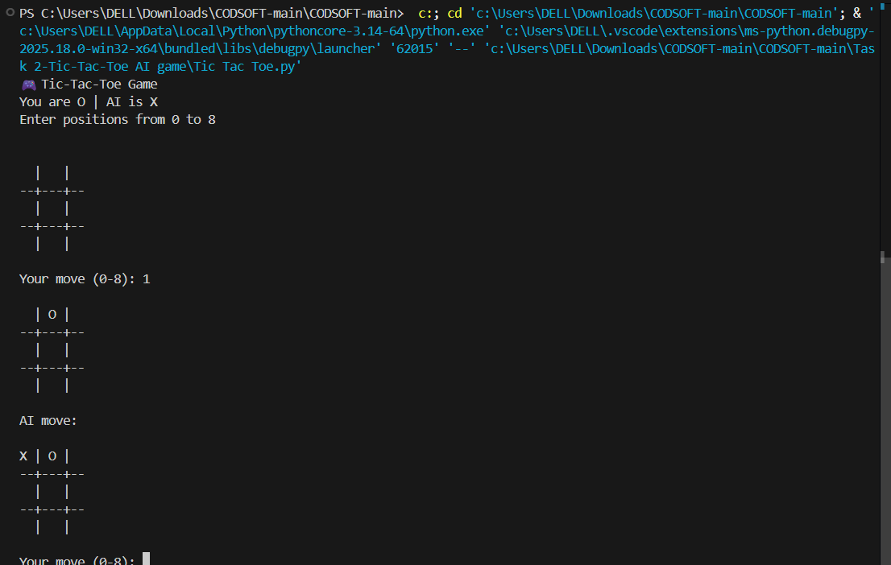

# ❌⭕ Tic Tac Toe AI Game (Python)

This project was completed as part of my **Artificial Intelligence Internship** at **CodSoft**.  
The project implements a **Tic Tac Toe game** where a human player competes against an **AI-controlled computer opponent**.

---

## 🖼️ Image Preview

### Sample Input Image

### Generated Caption Output

## 📌 Project Description
The **Tic Tac Toe AI Game** is a console-based application developed using **Python**, demonstrating decision-making and basic artificial intelligence concepts.

The computer makes intelligent moves based on predefined logic to compete with the player.

---

## 🧠 Key Concepts Used
- Artificial Intelligence fundamentals
- Game theory basics
- Decision-making logic
- Conditional statements
- Loops and control structures

---

## ✨ Features
- Player vs Computer gameplay
- Intelligent AI move selection
- Win, lose, and draw detection
- User-friendly console interface
- Input validation

---

## 🛠️ Technologies Used
- Python 3
- Rule-based and logic-based AI
- No external libraries required

---

## ▶️ How the Game Works
1. The player chooses a position on the board  
2. The AI analyzes available positions  
3. The AI makes the best possible move  
4. The game continues until win or draw  

---

## 🎯 Learning Outcomes
- Understanding AI decision-making
- Implementing game logic in Python
- Handling user input and validation
- Developing turn-based games

---

## 📄 Conclusion
This project strengthened my understanding of **AI-based decision making** and helped me implement a complete interactive game using Python.

---

## 📜 License

This project is created for educational and internship purposes.
