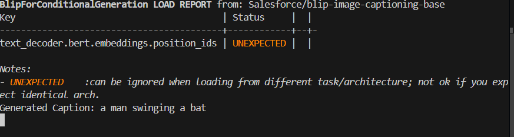

# 🖼️ Image Captioning using Python (AI Internship)

This project was completed as part of my **Artificial Intelligence Internship** at **CodSoft**.  
The goal of this task is to generate **meaningful textual descriptions (captions)** for given images using Artificial Intelligence techniques.

---

## 🖼️ Image Preview

### Generated Caption Output

## 📌 Project Description
**Image Captioning** is an AI task that combines **Computer Vision** and **Natural Language Processing (NLP)** to automatically describe the content of an image in the form of a sentence.

This project takes an image as input and produces a relevant caption as output.

---

## 🧠 Key Concepts Used
- Artificial Intelligence
- Computer Vision
- Natural Language Processing (NLP)
- Deep Learning fundamentals
- Feature extraction
- Sequence generation

---

## ✨ Features
- Accepts an image as input
- Extracts important visual features
- Generates a meaningful caption
- Automated image understanding
- Beginner-friendly implementation

---

## 🛠️ Technologies Used
- Python 3
- Artificial Intelligence concepts
- Deep Learning basics
- Pretrained models (if applicable)

---

## ▶️ How It Works
1. The image is given as input  
2. Important features are extracted from the image  
3. A language model processes these features  
4. A human-readable caption is generated  

---

## 🎯 Learning Outcomes
- Understanding how AI interprets images
- Hands-on experience with image-based models
- Integration of vision and language
- Practical exposure to real-world AI applications

---

## 📄 Conclusion
This project enhanced my understanding of **Image Captioning systems** and provided practical knowledge of how **Artificial Intelligence** can be used to bridge visual data and natural language.

---

## 📜 License

This project is created for educational and internship purposes.

